# Lakehouse Stack using Open Source Tools
A data lakehouse is a data management architecture that combines key capabilities of data lakes and data warehouses. It brings the benefits of a data lake, such as low storage cost and broad data access, and the benefits of a data warehouse, such as data structures and management features

## Watch the Overview Video

[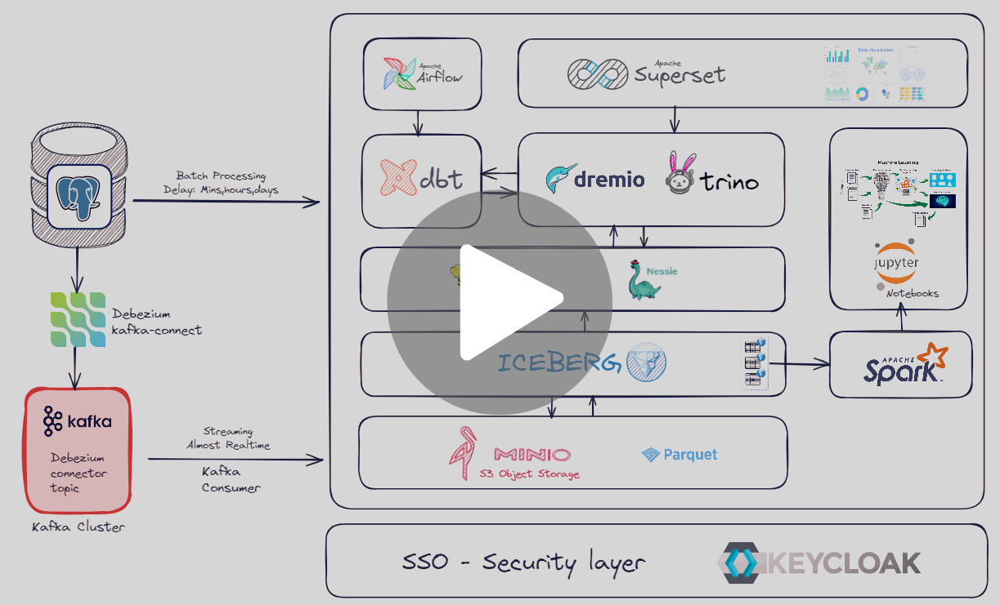](https://drive.google.com/file/d/1MUtFAFT788p2ewCjSE797EW6gYjnOsel/view?usp=sharing)

## Lakehouse Architecture
Data lakehouse architecture is an increasingly popular choice for many businesses because it supports interoperability between data lake formats. It supports ACID transactions and can run fast queries, typically through SQL commands, directly on object storage in the cloud or on-prem on structured and unstructured data.

The data lakehouse’s semantic layer also helps to simplify and open data access in an organization. Data consumers downstream, like data analysts and data scientists, can try new analytical approaches and run their own reports without needing to move or copy data – reducing the workload for data engineers. 

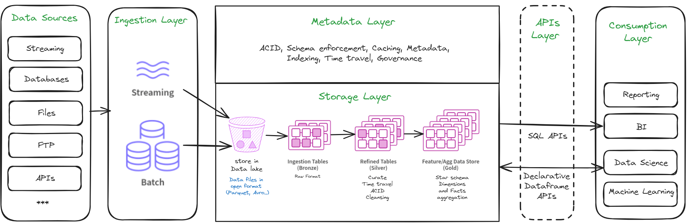

## The 5 key layers of data lakehouse architecture
You know what they always say: data lakehouse architecture is like an onion. 
…ok, so maybe they don’t say that. But they should!

1. **Ingestion layer**
The ingestion layer in data lakehouse architecture extracts data from various sources, including transactional and relational databases, APIs, real-time data streams, CRM applications, NoSQL databases, and more, and brings them into the data lake.

2. **Storage layer**
The storage layer in data lakehouse architecture is–you guessed it–the layer that stores the ingested data in low-cost stores, like MinioS3. 

3. **Metadata layer**
The metadata layer manages and organizes the metadata associated with the data that’s been ingested and stored. Metadata includes various information and insights about data, including orchestration jobs, transformation models, field profile, recent users and changes, past data quality incidents, and more.

4. **API layer**
APIs (application programming interfaces) enable analytics tools and third-party applications to query the data stored in the data lakehouse architecture. With an API call or integration, an analytic tool understands what datasets are required for a particular application and how to retrieve them, transform them, or write complex queries on the data. 

5. **Data Consumption Layer**
The consumption layer enables downstream consumers, like data scientists, data analysts, and other business users to leverage various tools, like Power BI, Tableau, and more to use their client apps to access the data stored in the data lake and all of its metadata. 

## Components

Here you can sets up a development environment for integrating an open source data lakehouse with:

### **Iceberg**
- **Description**: A high-performance table format for huge analytic datasets.
- **Role**: Provides reliable and performant data management in the lakehouse.


### **MinIO**
- **Description**: Serves as a storage server, mimicking a cloud storage environment locally.
- **Configuration**: Configured with essential security and region settings.
- **Ports**: Exposes ports 9000 for API access and 9001 for the console.
- **Role**: Provides the storage layer for the data lake, where data from Postgres can be stored and managed for processing with Trino & Dremio.

### **Nessie**
- **Description**: Acts as a catalog server using an in-memory store.
- **Ports**: Runs on port 19120.
- **Role**: Manages and versions data in the data lake, facilitating integration with Dremio and Postgres for table cataloging and version control.


### **Hive Metastore**
- **Description**: A central repository for metadata.
- **Role**: Manages metadata for data stored in the lakehouse, integrating with tools like Iceberg and Trino & Dremio.

### **Dremio**
- **Description**: The core component of the data lakehouse platform.
- **Ports**: Exposes ports 9047 (UI), 31010, and 32010 (data communication).
- **Role**: Enables direct querying and management of data across different sources like Postgres and MinIO.

### **Trino**
- **Description**: A distributed SQL query engine designed for interactive analytics.
- **Ports**: Typically runs on port 8080.
- **Role**: Allows for querying data across multiple data sources, including data stored in Iceberg tables.

### **Postgres**
- **Description**: Represents the source database.
- **Configuration**: Configured with basic credentials and a database name (mydb).
- **Ports**: Exposes container port 5432 to localhost:5435.
- **Role**: Source for data extraction and loading by Trino & Dremio.

### **Kafka**
- **Description**: A distributed streaming platform.
- **Role**: Manages real-time data feeds, allowing for data streaming into the data lakehouse environment.

### **dbt**
- **Description**: A data transformation tool that enables analysts and engineers to transform data in their warehouse more effectively.
- **Role**: Facilitates the transformation and modeling of data in the data lakehouse environment.

### **Airflow**
- **Description**: A platform to programmatically author, schedule, and monitor workflows.
- **Role**: Manages and automates data workflows, ensuring data processing tasks are executed in a timely manner.

### **Superset**
- **Description**: A business intelligence tool.
- **Ports**: Runs on port 8088 but is mapped to 8080 on the host machine.
- **Role**: Connects with Trino & Dremio for creating and viewing dashboards and reports.

### **Keycloak**
- **Description**: An open-source identity and access management solution.
- **Role**: Provides security and authentication for the various components of the data lakehouse.
    - Single sign on (SSO) on Minio, Trino, Airflow, Superset, Nessie with keycloak integration using OpenID Connect


# Prerequisites

- [Docker](https://docs.docker.com/get-docker/)
- [docker-compose](https://docs.docker.com/compose/install/)

## Setup Instructions

1. **Clone the Repository**:

   ```bash
   git clone https://github.com/octocampus/Lakehouse_stack.git
   cd lakehouse-stack
   cp .env.example .env


1. Setup the keycloak server if you dont have one;
2. ``` docker-compose up keycloak -d ``` 
3. Enter to keycloak with port 8080 and use admin admin as authentication
4. Create Realm in keycloak named as "nemo", after that create clients minio, supertset, trino, nessie, airflow and create user to login to our services using SSO
5. ``` docker-compose up minio -d ```
6. Create Bucket and access key for Minio
7. Edit .env file for the keycloak config and Minio access key.
8. Edit trino catalog and and proprieties files inside ./docker/trino/etc
9. Finaly start our project by running all services

# Running Project

``` docker-compose up -d ```

**Access the Services**

The compose file will build the images, be pacient maybe it might take a while at first time build.

- Visit http://localhost:8080 to access the keycloak app

- Visit http://localhost:8088 to access the superset app

- Visit http://localhost:9001 to access the minio app

- Visit http://localhost:9047 to access the dremio app

- Visit http://localhost:8090 to access the trino app

- Visit http://localhost:19120 to access the nessie app

- Visit http://localhost:8081 to access the airflow webserver

- Visit http://localhost:9021 to access the kafka connect

- Run ``` dbt docs generate ``` and ``` dbt docs serve --port 8010 ``` and access to dbt docs and data lineage by the http://localhost:8010

- Connect to Postgres: Use terminal and run ``` docker ps -a ``` take the container id of postgres and run ``` docker exec -it -u 0 container_id /bin/bash ``` and run ``` psql -U postgres -d postgres ```

- Hive Metastore: Typically interacts with the other components directly


# Configuration
## Data Lakehouse Technical Architecture
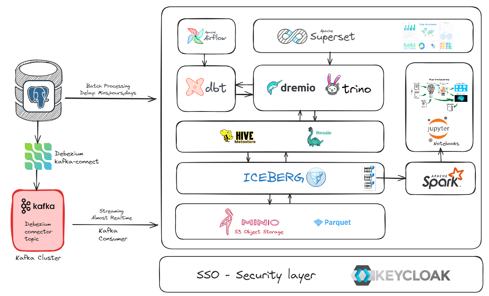

**MinIO**

- Create Minio Bucket with name of datalake

**Nessie**

- Configure Nessie to use in-memory storage or connect to a persistent backend for production use.

**Dremio**

- Set up Dremio to connect to MinIO, Postgres, and HMS or Nessie.

## Querying the Data in Dremio

Now that the data has been created, catalogs like Nessie for your Apache Iceberg tables offer easy visibility of your tables from tool to tool. We open Dremio and see we can immediately query the data we have in our Nessie catalog.

## Steps to Query Data in Dremio with nessie 

1. **Head over to Dremio Web Application**
   - Navigate to `http://localhost:9047`

2. **Create Your Admin User Account**
   - Follow the prompts to set up your admin user account.

3. **Add Nessie as a Source**
   - Once on the dashboard, click on “Add Source” in the bottom left corner.
   - Select “Nessie” from the list of sources.

4. **Configure Nessie Source**
   - Fill out the first two tabs as shown in the images below:

   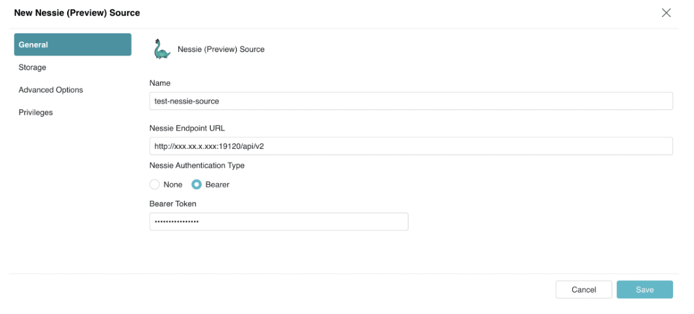
   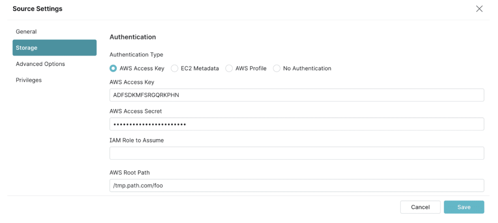

   - We use the Docker network URL for our Nessie server since it’s on the same Docker network as our Dremio container.
   - Select "None" for authentication unless you have set up your Nessie server to use tokens (default is none).
   - The second tab allows us to provide credentials for the storage of the data the catalog tracks. Use the keys obtained from Minio.
   - Set the following properties to use S3 compatible storage solutions like Minio:
     - `fs.s3a.path.style.access`
     - `fs.s3a.endpoint`
     - `dremio.s3.compat`
   - Since we are working with a local non-SSL network, turn off encryption on the connection.

## Configuring S3-Compatible Storage (Minio) with Dremio
You can use S3-compatible storage, such as MinIO, as a Dremio data source as long as the storage is completely S3-compatible. We recommend confirming S3 compatibility with the storage provider before you start the configuration steps.

To configure S3-compatible storage as a data source in the Dremio console:

1. Sign in to your Dremio Cloud account.

2. Under Datasets > Data Lakes, select the S3 source.

3. In the S3 source section, upper-right corner, click the Settings (gear) icon.

4. In the Edit Source dialog box, select **Advanced Options**.

5. Under the Advanced Options section, tick the checkbox for **Enable compatibility mode**.

6. Under the Connection Properties section, click **Add property**.

7. In the Name field, enter ```fs.s3a.path.style.access```.

8. In the Value field, enter ```true```.
## NOTE
This setting ensures that the request path is created correctly when using IP addresses or hostnames as the endpoint.

9. Click Add property again and add the ```fs.s3a.endpoint``` property and its corresponding server endpoint value (IP address). Please put ```minio:9000```


**Iceberg**

- Set up Iceberg tables within MinIO in Trino and Dremio.

 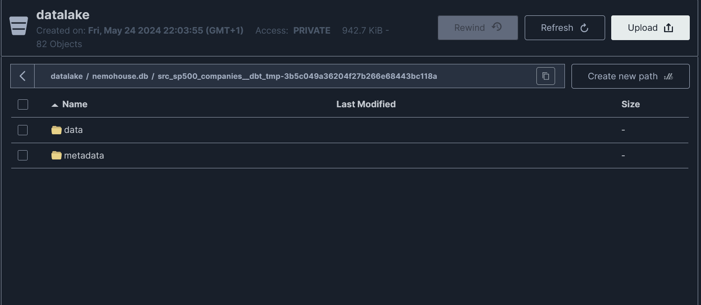

**Postgres**

- Initialize the database and set up schemas and tables as needed.

**Trino**

- Configure Trino to query data from various sources, including Iceberg tables as connector look at ./docker/trino/catalog

- Configure Trino with Keycloak by using taking the access key with this command:

``` curl -H "Content-Type: application/x-www-form-urlencoded" -d "client_id=trino" -d "client_secret=mkwNbb3bRfE9ECICDx1ZE9Wa2HsglX1p" -d "username=mustapha" -d "password=1234567" -d "grant_type=password" -d "scope=openid" "http://keycloak:8080/realms/nemo/protocol/openid-connect/token" ``` 

adjust the information as needed and copy the **access key** and after that run  

``` trino --server https://localhost:8443 --keystore-path=/etc/clustercoord.pem --access-key="access_key" --user "kycloak_first_name keycloak_last_name" ``` 

and run ``` show catalogs  ``` to see your connectors in Trino


- Connect trino to be able to create iceberg table using ``` use iceberg_hive.YOUR_SCHEMA ```


**Superset**

- Connect Superset to Trino and Dremio and configure your dashboards and reports.
Enter to Setting -> Database Connectors -> + Database -> choose trino from Supported databases -> and put 

``` trino://trino@trino.:8080/iceberg_hive ``` 

- the same thing with Dremio: 

``` dremio+flight://<dremio-username>:<dremio-password@dremio:32010/?UseEncryption=false ```

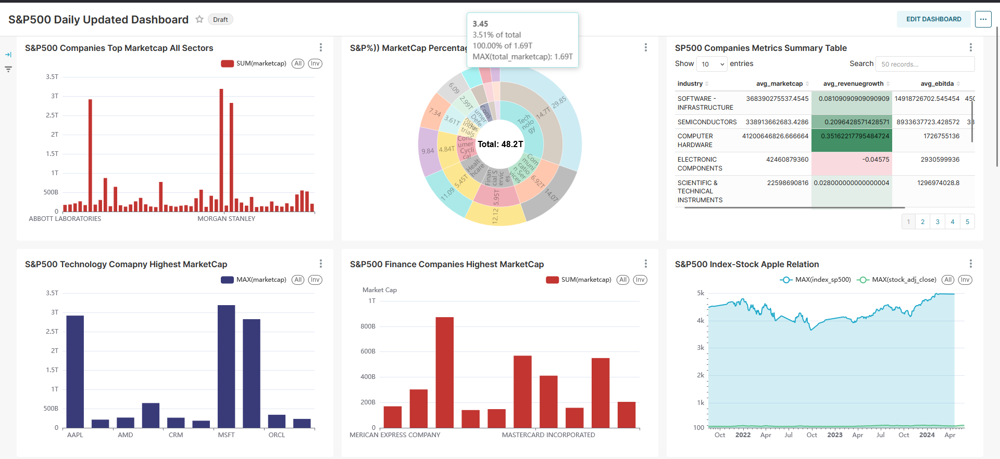
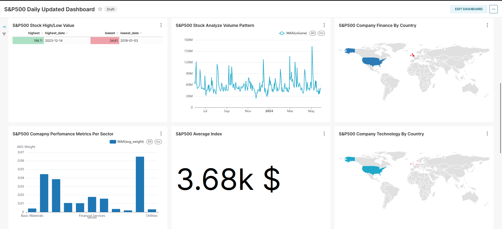

**dbt**

- Create dbt projects to manage data transformations. all dbt models orchestrated by airflow
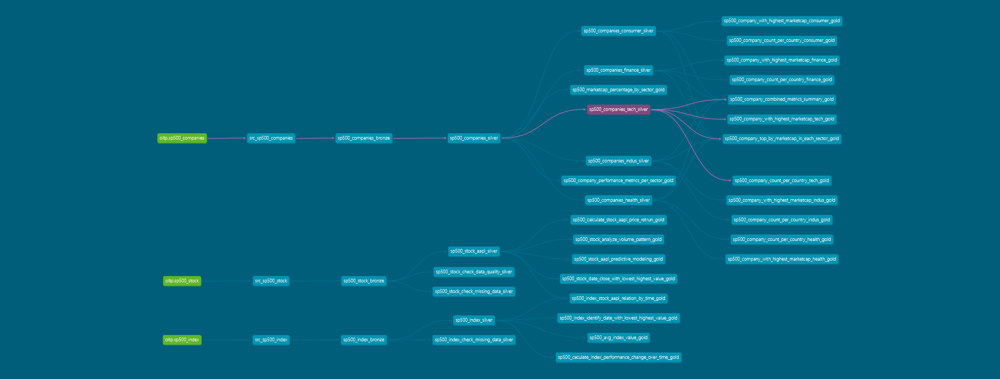


**Airflow**

- Define your workflows and schedule them according to your data processing needs. 

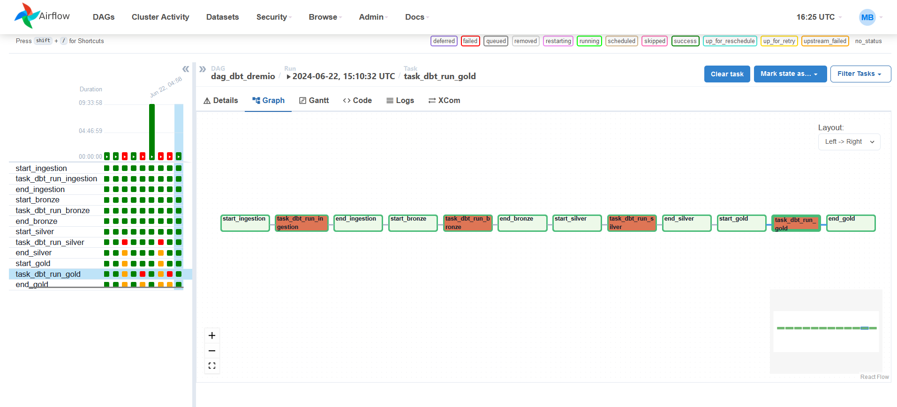

**Kafka**

- Set up topics and manage data streams into your lakehouse. using producer and consumer into the the kafka topics

**Nessie**

- Set up nessie with keycloak using this command ``` nessie --auth-token $NESSIE_AUTH_TOKEN remote show ```
You will find the acces token in curl command used in Trino with Keycloak

**Hive Metastore**

- Ensure metadata is correctly managed and accessible to tools like Trino , Dremio and Iceberg. see ./docker/trino/catalog/iceberg_hive

**keycloak**
The security layer we will ensure one set of credentials fro all services with SSO
Keycloak has many ways to implement it, such as through SSO, social media sign-in, or hitting their API to get an access token.

We would implement it with a stand-alone auth-service that handles additional custom flow that you may need, but for authenticating the credentials themselves, Keycloak is responsible. And verify the token on the service layer resource server.

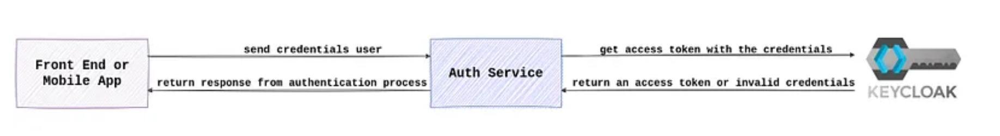

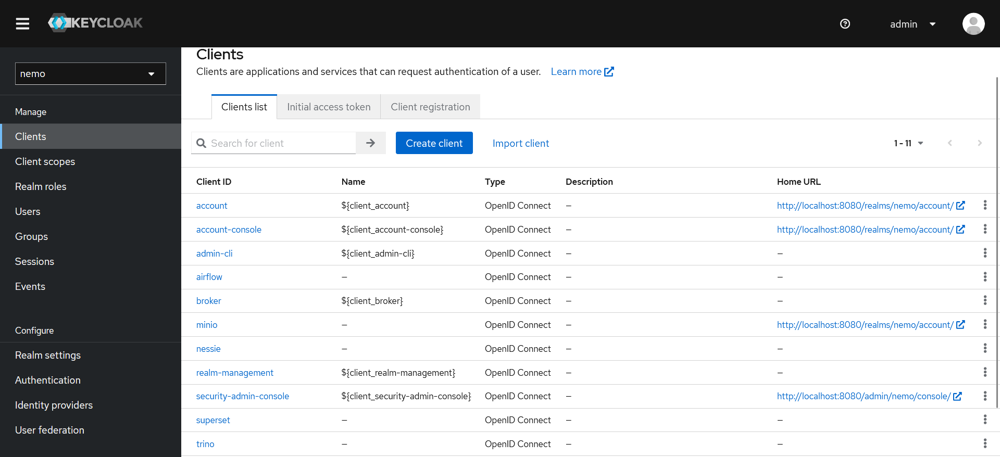

## Example Login with Keycloak SSO

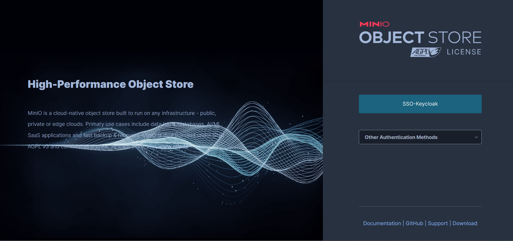
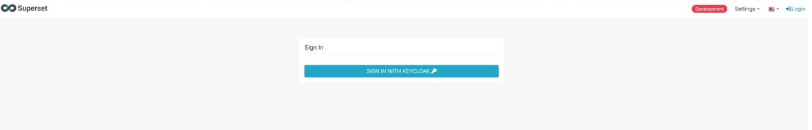


# Project Directory Structure

```
lakehouse_stack/
├── docker-compose.yml
├── Dockerfile
├── README.md
├── .env
├── .gitignore
├── docker/
│   ├── pythonpath_dev/
│   │   ├── keycloak_security_manager.py
│   │   ├── superset_config.py
│   ├── trino/
│   │   ├── etc/
│   │   │   ├── catalog/
│   │   │   │   ├── iceberg_hive.properties
│   │   │   │   ├── iceberg.properties
│   │   │   │   ├── iceberg.properties
│   │   │   ├── clustercoord.pem
│   │   │   ├── config.properties
│   │   │   ├── server.cert
│   │   │   ├── server.key
│   ├── docker-bootstrap.sh
│   ├── docker-ci.sh
│   ├── docker-frontend.sh
│   ├── docker-init.sh
│   ├── frontend-mem-nag.sh
│   ├── requirements-local.txt
│   ├── run-server.sh
├── airflow/
│   ├── config/
│   │   ├── airflow.cfg
│   │   ├── my_constants.py
│   │   ├── user_auth.py
│   │   ├── webserver-config.py
│   ├── dags/
│   │   ├── config
│   │   │   ├── dag.py
│   │   ├── dag_dbt.py
│   ├── logs/
│   └── plugins/
├── dbts/
│   ├── analyses
│   ├── macros
│   ├── models
│   │   ├── ingestion/
│   │   │   ├── src_sp500_companies.sql
│   │   │   ├── src_sp500_index.sql
│   │   │   ├── src_sp500_stock.sql
│   │   ├── semantic_layer/
│   │   │   ├── bronze/
│   │   │   ├── silver/
│   │   │   ├── gold/
│   │   ├── schema.yml
│   │   ├── sources.yml
│   ├── seeds
│   ├── snapshots
│   ├── target
│   ├── tests
│   ├── .user.yml
│   ├── dbt_project.yml
│   ├── packages.yml
│   ├── profiles.yml
├── dbt_dremio/
├── streaming/
├── data/
├── notebooks/
│   ├── analysis/
│   └── experiments/
```

# Contributing

We welcome contributions to the Data Lakehouse project! Whether you're reporting bugs, improving documentation, or contributing code, your help is greatly appreciated. To contribute, please follow these guidelines:


